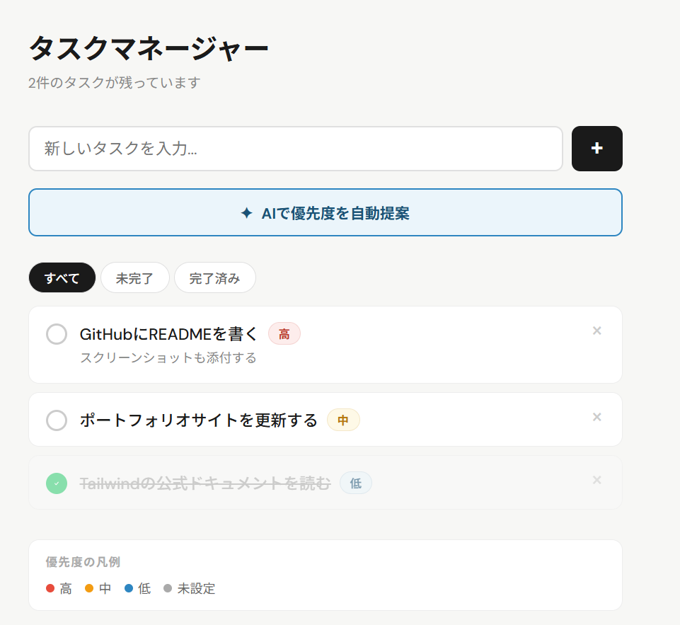

# ✦ AI Task Manager

AIが優先度を自動提案するタスク管理アプリです。Claude APIと連携し、タスク一覧を分析して high / medium / low の優先度と理由を自動付与します。


---

## 📸 スクリーンショット



---

## 🚀 機能

| 機能 | 説明 |
|------|------|
| タスク追加 | テキスト入力 + Enter またはボタンで即追加 |
| 完了チェック | クリックで完了／未完了をトグル |
| 削除 | 各タスクの × ボタンで削除 |
| **AI優先度提案** | ボタン1つで Claude API がタスクを一括分析し、優先度と理由を付与 |
| フィルタ | すべて／未完了／完了済みで絞り込み |

---

## 🛠 技術スタック

- **React 18** — UIコンポーネント・ローカルstate管理
- **Anthropic Claude API** (`claude-sonnet-4`) — タスク優先度の自然言語分析
- **CSS-in-JS（インラインスタイル）** — 外部ライブラリなし・軽量構成

---

## ⚙️ セットアップ

### 1. リポジトリをクローン

```bash
git clone https://github.com/nfspica/ai-task-manager.git
cd ai-task-manager
```

### 2. 依存パッケージをインストール

```bash
npx create-react-app .
# または既存のReactプロジェクトにApp.jsxを組み込む
npm install
```

### 3. 環境変数を設定

プロジェクトルートに `.env` ファイルを作成し、Anthropic APIキーを設定します。

```env
REACT_APP_ANTHROPIC_API_KEY=your_api_key_here
```

> APIキーは [Anthropic Console](https://console.anthropic.com/) で発行できます。

### 4. 起動

```bash
npm start
```

`http://localhost:3000` でアプリが起動します。

---

## 📁 ファイル構成

```
ai-task-manager/
├── src/
│   └── App.jsx        # メインコンポーネント（全機能を1ファイルに集約）
├── .env               # APIキー（Gitには含めない）
├── .gitignore
└── README.md
```

---

## 🔒 セキュリティについて

`.env` ファイルは `.gitignore` に追加し、APIキーをGitHubにコミットしないよう注意してください。

本番運用する場合は、Next.js の Route Handlers や BFF（Backend for Frontend）を通じてAPIキーをサーバー側で管理することを推奨します。

---

## 🗺 今後の拡張予定

- [ ] Supabase によるデータ永続化・ユーザー認証
- [ ] ドラッグ＆ドロップによるタスク並び替え
- [ ] 締切日・タグ機能の追加
- [ ] Next.js への移行（APIキーのサーバーサイド管理）

---

## 📄 ライセンス

MIT
